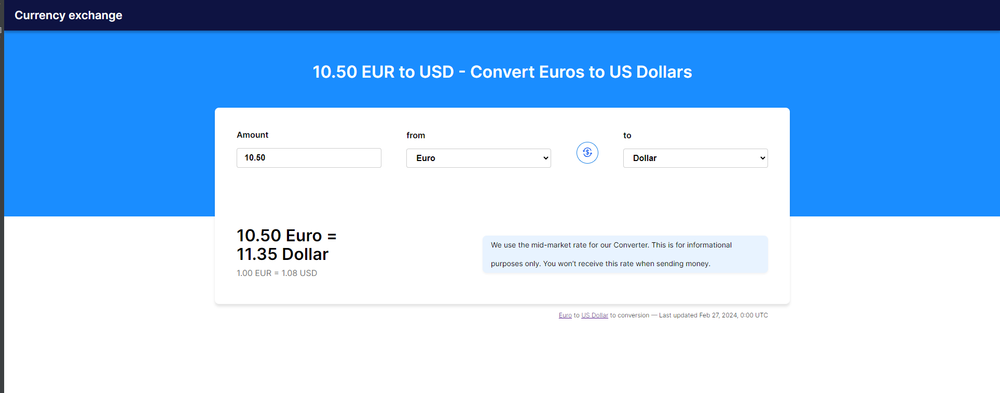
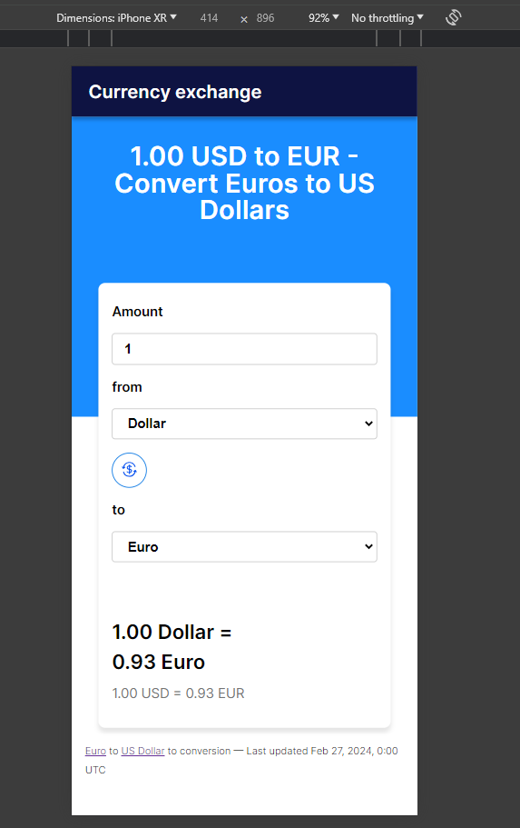

# React + TypeScript + Vite

- npm i
- npm run dev
- Ingresar a http://localhost:5173/

### Algunas modificaciones

- Todos los saldos se muestran con 2 decimales; internamente se utilizan todos los decimales.
- Cuando se ingresa un nuevo monto, hay un debounce o retraso de 500 ms antes de llamar a la API para actualizar los nuevos valores.
- El único punto de quiebre es de 480px.
- El pie de página de la última actualización se mantuvo fuera de la tarjeta para mantener el estilo.

#### Version desktop

#### Version mobile

